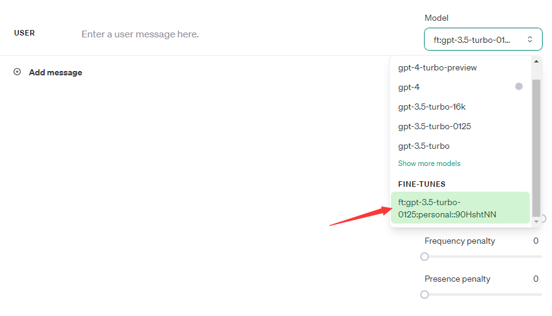

## This Repo is for fine-tuning ChatGPT to build custom ChatGPT.

### Python Environment

#### 1. Install Packages

```b
pip install -r requirements.txt
```

#### 2. Set Api Key

- Create a new openai api key, link: https://platform.openai.com/api-keys.


- Copy it into .env file

​	Set OPENAI_API_KEY="Your API KEY"

#### 3. Create Data For Fine-tuning

Here we use the question-answer dataset related to Ubuntu from Hugging Face. We will select 100 data from the training set for fine-tuning testing, and you can also modify it in the code.

The dataset link is [here](https://huggingface.co/datasets/mugithi/ubuntu_question_answer).

```bash
python create_data.py
```

After running it, you will see a **train_data.jsonl** file appearing in this directory, which is the data format required for fine-tuning ChatGPT.

#### 4. Fine-tune ChatGPT

```bas
python finetune.py
```

After running the above code, you will obtain a parameter called **job id** in the final output. You need to copy this parameter to your notepad because it will be used later on. 

It looks like **"ftjob-k66N8QIGu1ehgQmGRIbhXUuD"**.

Next, log in to your personal OpenAI interface, where you can monitor the progress of the fine-tuning process. The link is **https://platform.openai.com/finetune**. You need to wait for few minutes to see the beginning of fine-tuning, and then you can see the loss curve.


#### 5. Test New Model

Once you see the fine-tuning process has completed, you can start using your own ChatGPT. You have two methods to use it: one is to directly use through the chat interface at https://platform.openai.com/playground; alternatively, you can also use the id of the new model for local testing.

- Chat Interface



- Local Test

```ba
python test.py
```

During the running process, you will receive a **new_model_id**. You also need to save it because we will use this variable name in the next step.

#### 6. Compare Two Models

Now we can test the differences between the original ChatGPT and the newly fine-tuned model. You need to pass the previously saved **new_model_id** into the **compare.py** file.

```bas
python compare.py
```

We select some data from the test set of the dataset we initially chose for training, and store the labeled answers, original ChatGPT responses, and responses from our fine-tuned model in a json file and a csv file together. After the run completes, we will obtain two files named **results.json** and **results.csv**.


### Hope this Repo can help you.

